exam-reader
===========

.. image:: https://img.shields.io/badge/code%20style-black-000000.svg?style=flat-square&logo=appveyor)
        :target: https://github.com/python/black

.. image:: https://readthedocs.org/projects/exam-reader/badge/?version=latest&style=flat-square
        :target: https://exam-reader.readthedocs.io/en/latest/?badge=latest

.. image:: https://img.shields.io/badge/license-MIT-blue.svg
        :target: https://opensource.org/licenses/MIT

`Documentation <https://exam-reader.readthedocs.io.>`_

-----------------------------------------

Exam-reader – программа для извлечения и обработки данных из файлов, формирования разных отчётов и анализа данных.

Файлы протоколов проверки результатов ``ЕГЭ/ОГЭ/ВПР`` с расширением ``pdf`` представляют собой сводную таблицу по образовательной организации.

Проблема
===========

Протоколы результатов ``ЕГЭ/ОГЭ/ВПР`` приходят ежегодно в больших объёмах.

Школа должна предоставлять Министерству образования различную статистику:

* в целом по школе,
* по параллелям,
* по классам,
* по учащимся,
* по учителям,
* по предметам и т.п.

Это трудозатратно, так как это требует много сил и времени, потому что делается вручную.

.. figure:: https://i.imgur.com/qePOzLL.png
        :align: center

        Пример: картинка, `полученая с помощью ghostscript <https://www.ghostscript.com>`_

Принцип работы
==================

.. image:: https://i.imgur.com/wSmq5Ko.png

Зависимости (библиотеки).

* `camelot <https://github.com/camelot-dev/camelot>`_ извлечение таблиц PDF. Единственная библиотека, которая распознаёт данный вид таблиц правильно. `Сравнение с другими библиотеками и инструментами для извлечения таблиц PDF. <https://github.com/camelot-dev/camelot/wiki/Comparison-with-other-PDF-Table-Extraction-libraries-and-tools>`_
* `PyMupdf <https://github.com/pymupdf/PyMuPDF>`_ привязки Python для библиотеки рендеринга `MuPDF <https://mupdf.com>`_. Основная функция (которой нет у подобных библиотек) - `извлечение блоков текста <https://pymupdf.readthedocs.io/en/latest/textpage.html#TextPage.extractBLOCKS>`_.
* `peewee <https://github.com/coleifer/peewee>`_ очень удобная ORM (поддерживает postgres).
* `flask  <https://github.com/pallets/flask>`_  микро-фреймворк для создания веб-приложений.

Task (job)
===========
job - задачи, которые хранятся в бд, и worker выполняет эти задачи.

Поочередно добавляя только минимальное количество задач, которые он cможет решить, чтобы не терять задачи при выключении.

Структура job в бд:

* id
* path (CharField)
* status (SmallIntegerField)
    * 0 - не выполнилась
    * 1 - выполняется
    * 2 - закончила выполнение

Cli
========

.. code-block:: bash

    python3 -m exam_reader [OPTIONS] COMMAND [ARGS]...

Добавление файлов в очередь (db).
-----------------------------------

.. code-block:: bash

    python3 -m exam_reader add files/ege2016.pdf files/ege2016.pdf

Запуск воркера.
-----------------------------------

* -c, --count [int] количество процессов в воркере (default 3)
* -d, --debug показывает строку состояния (без -f, --files), иначе показывает обычные сообщения о задачах (dafult false)
* -f, --files [int] добавляет в очередь тестовые фалы количеством, которое вы указали. (запускается для тестов производительности, незавершённые задачи ставит в очередь снова (1) строчка)

Запуск воркера с добавлением файлов.

Для примера надо открыть два терминала (1 - для запуска воркера, 2 - добавления задачь).

TODO !! condition (sigkill) gif как в `dramatiq <https://dramatiq.io/>`_

.. code-block:: bash

    python3 -m exam_reader worker -c 2 -d -f 2

Запуск теста производительности:

.. code-block:: bash

    python3 -m exam_reader worker -c 2 -d -f 2

Процесс разработки
========================

* Добавлена обработка pdf файлов с помощью `multiprocessing JoinableQueue <https://docs.python.org/3/library/multiprocessing.html#multiprocessing.JoinableQueue>`_ camelot и PyMupdf.

* 05.11.20 Добавлен воркер (db) и основная документация к нему, также некоторые примеры)
